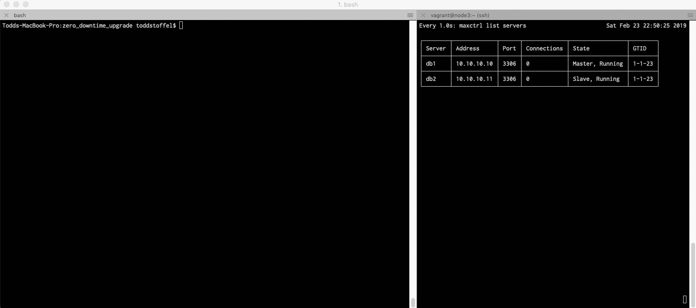

# MariaDB "Zero Downtime" Rolling Cluster Upgrade
## Using the MaxScale API and Ansible Automation

#### About

This automation project will use [Vagrant](https://www.vagrantup.com/downloads.html) to create 3 virtual servers using [Virtualbox](https://www.virtualbox.org/wiki/Downloads).

After building your environment with Vagrant and running the "[provision.yml](provision.yml)" playbook, you will have a 3 node MariaDB cluster with 1 master, 1 slave and a Maxscale database proxy.

You will then be ready to test the "[upgrade.yml](upgrade.yml)" playbook.  This script can be used in your own environments to upgrade MariaDB servers without taking an outage. See the animated image below for more info.

*(Tested with both [centos/7](https://app.vagrantup.com/centos/boxes/7) and [ubuntu/bionic64](https://app.vagrantup.com/ubuntu/boxes/bionic64) Vagrant boxes)*

#### Prerequisites

* [Git](https://git-scm.com/download/)
* [Vagrant](https://www.vagrantup.com/downloads.html)
* [Virtualbox](https://www.virtualbox.org/wiki/Downloads)
* [Ansible](http://docs.ansible.com/ansible/latest/intro_installation.html)

#### Setup

* `git clone https://github.com/toddstoffel/zero_downtime_upgrade.git`
* `cd zero_downtime_upgrade`
* `vagrant plugin install vagrant-vbguest`
* `vagrant up`
* `ansible-playbook provision.yml`

#### Rolling Upgrade

* `ansible-playbook upgrade.yml`

*The screen on the left is an example run of the "[upgrade.yml](upgrade.yml)" playbook.*

*The screen on the right is the output from `watch -n1 maxctrl list servers` on node3*.

#### MariaDB Node Access

* To access db1: `vagrant ssh node1`
* To access db2: `vagrant ssh node2`

#### MaxScale Node Access

* To access mx1: `vagrant ssh node3`

#### Notes

By default this project uses Centos 7. If you would like to use another distro, please edit the following file:

* [Vagrantfile](Vagrantfile)

The Ansible playbook is designed to be OS agnostic and should not require altering. However, further customization can be performed by editing these files:

* [inventory/hosts](inventory/hosts)
* [inventory/group_vars/all.yml](inventory/group_vars/all.yml)  <-- Verify your ethernet interface. This can change with different Linux distros.

####  Clean Up

* `vagrant destroy --force`

#### Need Additional Help?

* Consulting: https://mariadb.com/services/consulting
